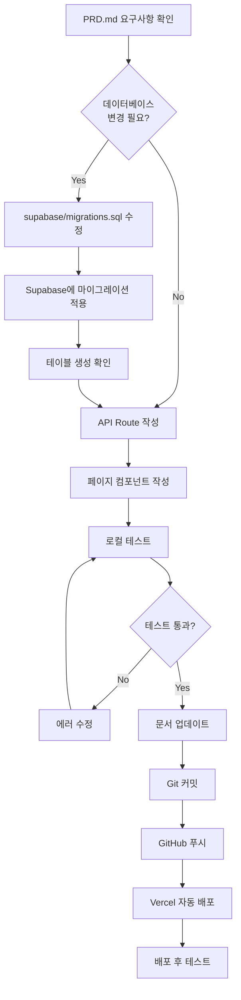
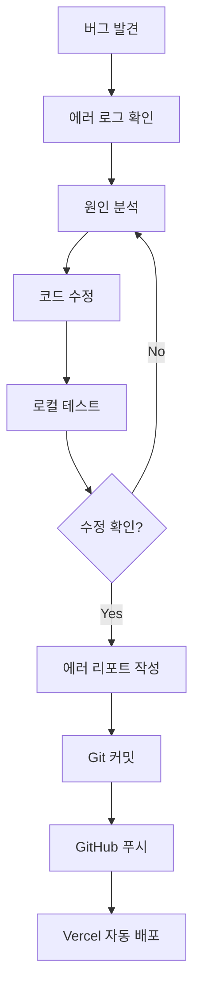
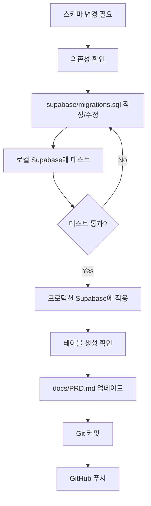

# 업무 순서 프로세스 (Workflow Process)

이 문서는 쇼핑몰 MVP 프로젝트의 핵심 기능 관계, 업데이트 적용 순서, 배포 및 커밋 순서를 정리한 업무 프로세스 가이드입니다.

**기준 문서**: `docs/PRD.md`, `docs/TODO.md`, `VERCEL_DEPLOYMENT_CHECKLIST.md`, `MIGRATION_PROGRESS.md`

---

## 📋 목차

1. [핵심 기능 관계도](#1-핵심-기능-관계도)
2. [데이터베이스 업데이트 순서](#2-데이터베이스-업데이트-순서)
3. [코드 업데이트 적용 순서](#3-코드-업데이트-적용-순서)
4. [Git 커밋 전략](#4-git-커밋-전략)
5. [배포 프로세스](#5-배포-프로세스)
6. [체크리스트](#6-체크리스트)

---

## 1. 핵심 기능 관계도

### 1.1 기능 의존성

```
┌─────────────────┐
│   인증 시스템   │
│   (Clerk)       │
└────────┬────────┘
         │
         ▼
┌─────────────────┐      ┌─────────────────┐
│  사용자 동기화  │──────▶│  Supabase Users │
│  (sync-user)    │      │     테이블      │
└─────────────────┘      └─────────────────┘
         │
         │
         ▼
┌─────────────────┐      ┌─────────────────┐
│  상품 조회      │──────▶│   Products      │
│  (products API) │      │     테이블      │
└────────┬────────┘      └─────────────────┘
         │
         │ (image_url 없으면)
         ▼
┌─────────────────┐
│  Tavily API     │ (이미지 보강)
│  (image search) │
└─────────────────┘
         │
         ▼
┌─────────────────┐      ┌─────────────────┐
│  장바구니       │──────▶│   Cart Items    │
│  (cart API)     │      │     테이블      │
└────────┬────────┘      └─────────────────┘
         │
         │ (주문하기)
         ▼
┌─────────────────┐      ┌─────────────────┐
│  주문 생성      │──────▶│   Orders        │
│  (orders API)   │      │     테이블      │
└────────┬────────┘      └────────┬────────┘
         │                        │
         │                        ▼
         │                ┌─────────────────┐
         │                │  Order Items    │
         │                │     테이블      │
         │                └─────────────────┘
         │
         ▼
┌─────────────────┐
│  결제 처리      │
│  (Toss Payments)│
└─────────────────┘
```

### 1.2 기능별 의존성 우선순위

1. **인프라 설정 (P0 - 최우선)**

   - Next.js 프로젝트 설정
   - Clerk 인증 설정
   - Supabase 연동
   - 환경 변수 설정

2. **사용자 관리 (P0)**

   - Clerk 인증 (독립적)
   - 사용자 동기화 (Clerk → Supabase)
   - 사용자 테이블 생성

3. **상품 기능 (P0)**

   - Products 테이블 생성 (독립적)
   - 상품 조회 API
   - 상품 목록/상세 페이지
   - Tavily 이미지 보강 (선택적, Products에 의존)

4. **장바구니 기능 (P0)**

   - Cart Items 테이블 생성 (Products, Users에 의존)
   - 장바구니 API (Users, Products에 의존)
   - 장바구니 페이지

5. **주문 기능 (P0)**

   - Orders, Order Items 테이블 생성 (Cart Items에 의존)
   - 주문 API (Cart Items에 의존)
   - 주문서 페이지

6. **결제 기능 (P0)**

   - Toss Payments 연동 (Orders에 의존)
   - 결제 검증 API
   - 결제 페이지

7. **마이페이지 (P0)**
   - 주문 내역 조회 (Orders에 의존)

---

## 2. 데이터베이스 업데이트 순서

> **참고 문서**: [Supabase Database Migrations Guide](https://supabase.com/docs/guides/database/overview)  
> **참고 문서**: [Supabase Database Migrations](https://supabase.com/docs/guides/deployment/database-migrations)

### 2.1 마이그레이션 파일 작성 순서

**원칙 (Supabase 공식 문서 기준)**: 의존성 없는 객체부터 순서대로 작성

> **참고**: Supabase 마이그레이션은 **순차적으로(sequential order)** 실행됩니다. 각 마이그레이션은 이전 마이그레이션을 기반으로 실행되므로 순서가 매우 중요합니다.

#### 2.1.1 기본 작성 순서

```sql
-- 1단계: ENUM 타입 정의 (의존성 없음)
CREATE TYPE order_status AS ENUM ('pending', 'completed', 'cancelled');
CREATE TYPE payment_status AS ENUM ('pending', 'paid', 'failed');

-- 2단계: Users 테이블 (의존성 없음)
CREATE TABLE IF NOT EXISTS users (
  id UUID PRIMARY KEY DEFAULT gen_random_uuid(),
  clerk_id TEXT UNIQUE NOT NULL,
  name TEXT,
  created_at TIMESTAMPTZ DEFAULT NOW()
);

-- 3단계: Products 테이블 (의존성 없음)
CREATE TABLE IF NOT EXISTS products (
  id UUID PRIMARY KEY DEFAULT gen_random_uuid(),
  name TEXT NOT NULL,
  description TEXT,
  price DECIMAL(10, 2) NOT NULL,
  category TEXT,
  image_url TEXT,
  created_at TIMESTAMPTZ DEFAULT NOW()
);

-- 4단계: Cart Items 테이블 (Products 의존)
CREATE TABLE IF NOT EXISTS cart_items (
  id UUID PRIMARY KEY DEFAULT gen_random_uuid(),
  clerk_id TEXT NOT NULL,
  product_id UUID NOT NULL REFERENCES products(id) ON DELETE CASCADE,
  quantity INTEGER NOT NULL DEFAULT 1,
  created_at TIMESTAMPTZ DEFAULT NOW(),
  UNIQUE(clerk_id, product_id)
);

-- 5단계: Orders 테이블 (Users 의존, ENUM 의존)
CREATE TABLE IF NOT EXISTS orders (
  id UUID PRIMARY KEY DEFAULT gen_random_uuid(),
  clerk_id TEXT NOT NULL,
  order_number TEXT UNIQUE NOT NULL,
  status order_status DEFAULT 'pending',
  payment_status payment_status DEFAULT 'pending',
  total_amount DECIMAL(10, 2) NOT NULL,
  created_at TIMESTAMPTZ DEFAULT NOW()
);

-- 6단계: Order Items 테이블 (Orders, Products 의존)
CREATE TABLE IF NOT EXISTS order_items (
  id UUID PRIMARY KEY DEFAULT gen_random_uuid(),
  order_id UUID NOT NULL REFERENCES orders(id) ON DELETE CASCADE,
  product_id UUID REFERENCES products(id) ON DELETE SET NULL,
  quantity INTEGER NOT NULL,
  price DECIMAL(10, 2) NOT NULL,
  created_at TIMESTAMPTZ DEFAULT NOW()
);
```

#### 2.1.2 인덱스 생성 순서

**원칙**: 테이블 생성 **후** 인덱스 생성

```sql
-- Products 테이블 인덱스 (테이블 생성 후)
CREATE INDEX IF NOT EXISTS idx_products_category ON products(category);
CREATE INDEX IF NOT EXISTS idx_products_is_active ON products(is_active);
CREATE INDEX IF NOT EXISTS idx_products_created_at ON products(created_at DESC);

-- Cart Items 테이블 인덱스 (테이블 생성 후)
CREATE INDEX IF NOT EXISTS idx_cart_items_clerk_id ON cart_items(clerk_id);
CREATE INDEX IF NOT EXISTS idx_cart_items_product_id ON cart_items(product_id);
CREATE INDEX IF NOT EXISTS idx_cart_items_clerk_created ON cart_items(clerk_id, created_at DESC);

-- Orders 테이블 인덱스 (테이블 생성 후)
CREATE INDEX IF NOT EXISTS idx_orders_clerk_id ON orders(clerk_id);
CREATE INDEX IF NOT EXISTS idx_orders_order_number ON orders(order_number);
CREATE INDEX IF NOT EXISTS idx_orders_status ON orders(status);
```

#### 2.1.3 트리거 생성 순서

**원칙**: 함수 정의 → 트리거 생성

```sql
-- 1단계: 트리거 함수 정의 (함수가 먼저 존재해야 함)
CREATE OR REPLACE FUNCTION update_updated_at_column()
RETURNS TRIGGER AS $$
BEGIN
    NEW.updated_at = NOW();
    RETURN NEW;
END;
$$ LANGUAGE plpgsql;

-- 2단계: 각 테이블에 트리거 생성 (테이블 생성 후, 함수 정의 후)
CREATE TRIGGER update_products_updated_at
  BEFORE UPDATE ON products
  FOR EACH ROW EXECUTE FUNCTION update_updated_at_column();

CREATE TRIGGER update_cart_items_updated_at
  BEFORE UPDATE ON cart_items
  FOR EACH ROW EXECUTE FUNCTION update_updated_at_column();

CREATE TRIGGER update_orders_updated_at
  BEFORE UPDATE ON orders
  FOR EACH ROW EXECUTE FUNCTION update_updated_at_column();
```

### 2.2 마이그레이션 파일 적용 순서

> **참고**: Supabase 마이그레이션은 타임스탬프 순서대로 실행됩니다. 마이그레이션 파일명은 `YYYYMMDDHHMMSS_description.sql` 형식을 따라야 합니다.

#### 2.2.1 로컬 테스트 순서

**Supabase 공식 문서 권장 순서**:

1. **마이그레이션 파일 생성**

   ```bash
   supabase migration new create_products_table
   ```

2. **마이그레이션 파일에 SQL 작성**

   - `supabase/migrations/<timestamp>_create_products_table.sql` 파일에 SQL 작성

3. **로컬 데이터베이스에 적용 및 테스트**

   ```bash
   supabase db reset
   ```

   - 모든 마이그레이션을 처음부터 다시 실행하여 테스트
   - 로컬 데이터베이스가 완전히 재생성됨

4. **로컬에서 마이그레이션 단계별 적용 테스트 (선택적)**
   ```bash
   supabase migration up
   ```
   - 새로운 마이그레이션만 순차적으로 적용

#### 2.2.2 프로덕션 배포 순서

**Supabase 공식 문서 권장 순서**:

1. **로컬에서 모든 테스트 완료 확인**

   ```bash
   supabase db reset
   # 모든 기능 정상 동작 확인
   ```

2. **Supabase CLI 로그인**

   ```bash
   supabase login
   ```

3. **프로젝트 링크**

   ```bash
   supabase link --project-ref $PROJECT_ID
   ```

4. **프로덕션 데이터베이스에 마이그레이션 푸시**

   ```bash
   supabase db push
   ```

   - 새로운 마이그레이션만 순차적으로 적용됨
   - 기존 마이그레이션은 건너뛰고 새로운 것만 실행

5. **Supabase Dashboard에서 확인**
   - SQL Editor에서 테이블 생성 확인:
     ```sql
     SELECT table_name FROM information_schema.tables
     WHERE table_schema = 'public'
     AND table_name IN ('users', 'products', 'cart_items', 'orders', 'order_items');
     ```

### 2.3 주의사항

> **참고**: Supabase 공식 문서에서 명시한 주의사항

#### 2.3.1 마이그레이션 파일 작성 시 주의사항

1. **타임스탬프 순서 준수**

   - 마이그레이션은 타임스탬프 순서대로 실행됨
   - Git rebase 후 타임스탬프가 바뀌면 순서 재조정 필요

2. **의존성 확인**

   - 나중에 실행되는 마이그레이션이 이전 마이그레이션에 의존하는 경우 순서 확인
   - 외래키(Foreign Key)가 참조하는 테이블이 먼저 생성되어야 함

3. **IF NOT EXISTS 사용**

   - `CREATE TABLE IF NOT EXISTS` 권장
   - 이미 존재하는 객체를 다시 생성하려 할 때 에러 방지

4. **롤백 고려**

   - 마이그레이션 롤백은 새로운 마이그레이션 파일로 처리
   - 기존 마이그레이션 파일 수정 금지 (이미 적용된 마이그레이션)

5. **데이터 손실 방지**
   - `DROP TABLE`, `DROP COLUMN` 등 파괴적 변경 주의
   - 프로덕션 데이터가 있는 경우 백업 필수

#### 2.3.2 마이그레이션 적용 시 주의사항

1. **로컬 테스트 필수**

   - 프로덕션 배포 전 반드시 로컬에서 `supabase db reset` 실행하여 테스트
   - 모든 마이그레이션이 정상적으로 실행되는지 확인

2. **권한 확인**

   - Dashboard에서 생성한 테이블은 `supabase_admin` 소유
   - CLI로 생성한 마이그레이션은 `postgres` 역할로 실행
   - `ALTER TABLE` 권한 오류 발생 가능성 있음
   - 해결: `ALTER TABLE <table_name> OWNER TO postgres;`

3. **네트워크 제한**

   - Network Restrictions 활성화 시 브랜치 클러스터 접근 허용 필요
   - IPv6 CIDR 범위 허용: `2600:1f18:2b7d:f600::/56`

4. **마이그레이션 실패 시**

   - SQL 구문 오류 확인
   - 의존성 확인 (존재하지 않는 객체 참조)
   - 권한 확인 (superuser 권한 필요한 작업)

5. **시퀀스 동기화**
   - 데이터 가져오기 후 시퀀스가 동기화되지 않을 수 있음
   - 확인:
     ```sql
     SELECT MAX(id) FROM products;
     SELECT nextval(pg_get_serial_sequence('public.products', 'id'));
     ```
   - 수정:
     ```sql
     SELECT setval('public.products_id_seq', (SELECT MAX(id) FROM products) + 1);
     ```

#### 2.3.3 프로덕션 배포 시 주의사항

1. **백업 확인**

   - 프로덕션 데이터베이스 변경 전 백업 필수
   - Supabase Dashboard → Settings → General에서 백업 가능

2. **단계적 배포**

   - 큰 변경사항은 여러 마이그레이션으로 분리
   - 각 마이그레이션마다 테스트 및 확인

3. **다운타임 최소화**

   - 인덱스 생성은 `CREATE INDEX CONCURRENTLY` 사용 (PostgreSQL 12+)
   - 테이블 수정 시 `ALTER TABLE` 옵션 주의

4. **마이그레이션 버전 확인**

   ```bash
   supabase migration list
   ```

   - 로컬과 프로덕션의 마이그레이션 버전 일치 확인

5. **스키마 드리프트 방지**
   - 여러 브랜치에서 동시 작업 시 스키마 충돌 주의
   - Git merge/rebase 후 마이그레이션 순서 재확인

---

## 3. 코드 업데이트 적용 순서

### 3.1 기본 원칙

**⚠️ 중요: 코드 업데이트 전 변경사항을 MD 파일에 먼저 기록해야 합니다.**

모든 코드 변경은 다음 순서를 따라야 합니다:

#### 3.1.1 AI 작업 프로세스 (필수)

**기능 업데이트나 내용 추가 시 반드시 다음 순서를 따라야 합니다:**

1. **Plan 모드로 계획 수립 (필수)**
   - 기능 업데이트나 내용 추가 요청 시 먼저 계획 수립
   - `mcp_create_plan` 도구를 사용하여 상세한 구현 계획 작성
   - 구현 방향과 단계를 명확히 정리
   - 사용자 승인 후 진행

2. **TODO.md에 구현 상세 내용 기재 (필수)**
   - 계획 수립 후 `docs/TODO.md`에 상세 작업 내용 반영
   - 체크리스트 형태로 단계별 작업 정리
   - 각 작업 항목에 대한 설명 및 요구사항 명시

3. **계획 승인 후 실행**
   - 사용자 승인을 받은 후 실제 구현 진행
   - TODO.md의 항목을 단계적으로 완료 처리
   - 각 단계 완료 시 TODO 상태 업데이트 (`todo_write` 도구 사용)

**작업 프로세스 예시:**

```
1. 사용자 요청: "인기상품 섹션을 생성해줘"
   ↓
2. Plan 모드: 계획 수립 및 사용자 승인 대기
   ↓
3. TODO.md 업데이트: 구현 상세 내용 기재
   ↓
4. 사용자 승인: "Implement the plan as specified"
   ↓
5. 실행: TODO.md 항목을 단계적으로 완료하며 구현
```

#### 3.1.2 일반 코드 변경 순서

1. **변경 계획 MD 파일에 기록** (필수)

   - 변경하려는 내용을 MD 파일에 먼저 작성
   - `docs/PRD.md`, `docs/TODO.md` 또는 관련 문서에 기록
   - 변경 이유, 영향 범위, 의존성 명시

2. **코드 업데이트 실행**

   - MD 파일에 기록된 내용을 바탕으로 코드 작성/수정

3. **문서 동기화 확인**
   - 코드 변경 후 관련 문서 업데이트 확인

### 3.2 상품 기능 업데이트 순서

**순서**: 변경 계획 기록 → 데이터베이스 → API → 컴포넌트

```
1. 변경 계획 MD 파일에 기록 (필수)
   └─> docs/PRD.md 또는 docs/TODO.md에 변경 내용 기록
   └─> 변경 이유, API 스펙, 데이터 구조 등 명시

2. 데이터베이스 마이그레이션
   └─> supabase/migrations.sql에 변경 사항 작성
   └─> 로컬에서 supabase db reset으로 테스트

3. API Route 생성
   └─> app/api/products/route.ts
   └─> app/api/products/[id]/route.ts
   └─> MD 파일에 기록된 스펙대로 구현

4. 유틸리티 함수 생성 (선택적)
   └─> lib/utils/image-placeholder.ts (Tavily API)
   └─> MD 파일에 기록된 기능대로 구현

5. API Route에 이미지 보강 로직 추가 (선택적)
   └─> app/api/products/route.ts 수정
   └─> app/api/products/[id]/route.ts 수정
   └─> MD 파일에 기록된 로직대로 구현

6. 페이지 컴포넌트 생성
   └─> app/products/page.tsx
   └─> app/products/[id]/page.tsx
   └─> MD 파일에 기록된 UI/UX대로 구현

7. 공통 컴포넌트 생성
   └─> components/ProductCard.tsx
   └─> components/ProductSection.tsx
   └─> MD 파일에 기록된 디자인대로 구현

8. 문서 업데이트 확인
   └─> docs/PRD.md 최종 확인 및 업데이트
   └─> docs/TODO.md 완료 항목 체크
```

```
1. 데이터베이스 마이그레이션
   └─> supabase/migrations.sql (products 테이블)

2. API Route 생성
   └─> app/api/products/route.ts
   └─> app/api/products/[id]/route.ts

3. 유틸리티 함수 생성 (선택적)
   └─> lib/utils/image-placeholder.ts (Tavily API)

4. API Route에 이미지 보강 로직 추가
   └─> app/api/products/route.ts 수정
   └─> app/api/products/[id]/route.ts 수정

5. 페이지 컴포넌트 생성
   └─> app/products/page.tsx
   └─> app/products/[id]/page.tsx

6. 공통 컴포넌트 생성
   └─> components/ProductCard.tsx
   └─> components/ProductSection.tsx
```

### 3.3 장바구니 기능 업데이트 순서

**순서**: 변경 계획 기록 → 데이터베이스 → API → 컴포넌트 → 테스트

```
1. 변경 계획 MD 파일에 기록 (필수)
   └─> docs/PRD.md에 장바구니 기능 스펙 기록
   └─> API 엔드포인트, 데이터 구조, UI/UX 명시

2. 데이터베이스 마이그레이션
   └─> supabase/migrations.sql에 cart_items 테이블 추가
   └─> 로컬에서 supabase db reset으로 테스트

3. API Route 생성
   └─> app/api/cart/route.ts (GET, POST)
   └─> app/api/cart/[id]/route.ts (PUT, DELETE)
   └─> MD 파일에 기록된 API 스펙대로 구현

4. 페이지 컴포넌트 생성
   └─> app/cart/page.tsx
   └─> MD 파일에 기록된 UI/UX대로 구현

5. 통합 테스트
   └─> 상품 상세 페이지에서 장바구니 추가 테스트
   └─> 장바구니 페이지에서 수량 변경/삭제 테스트

6. 문서 업데이트 확인
   └─> docs/PRD.md 최종 확인 및 업데이트
   └─> docs/TODO.md 완료 항목 체크
```

### 3.4 주문 및 결제 기능 업데이트 순서

**순서**: 변경 계획 기록 → 데이터베이스 → API → 컴포넌트 → 통합

```
1. 변경 계획 MD 파일에 기록 (필수)
   └─> docs/PRD.md에 주문/결제 프로세스 기록
   └─> 주문 상태, 결제 플로우, API 스펙 명시

2. 데이터베이스 마이그레이션
   └─> supabase/migrations.sql에 orders, order_items 테이블 추가
   └─> 로컬에서 supabase db reset으로 테스트

3. 주문 API Route 생성
   └─> app/api/orders/route.ts (POST, GET)
   └─> app/api/orders/[id]/route.ts (GET)
   └─> MD 파일에 기록된 스펙대로 구현

4. 결제 API Route 생성
   └─> app/api/payments/verify/route.ts
   └─> app/api/payments/callback/route.ts
   └─> MD 파일에 기록된 결제 플로우대로 구현

5. 페이지 컴포넌트 생성
   └─> app/orders/create/page.tsx (주문서 작성)
   └─> app/orders/[id]/success/page.tsx (주문 완료)
   └─> app/payments/[orderId]/page.tsx (결제 페이지)
   └─> app/my/page.tsx (마이페이지)
   └─> app/my/orders/[id]/page.tsx (주문 상세)
   └─> MD 파일에 기록된 UI/UX대로 구현

6. 문서 업데이트 확인
   └─> docs/PRD.md 최종 확인 및 업데이트
   └─> docs/TODO.md 완료 항목 체크
```

### 3.5 이미지 보강 기능 업데이트 순서

**순서**: 변경 계획 기록 → 환경 설정 → 유틸리티 → API 수정 → 문서

```
1. 변경 계획 MD 파일에 기록 (필수)
   └─> docs/PRD.md에 Tavily API 연동 계획 기록
   └─> 이미지 보강 로직, 에러 처리 방법 명시

2. 환경 변수 추가
   └─> .env.local에 TAVILY_API_KEY 추가

3. 유틸리티 함수 생성
   └─> lib/utils/image-placeholder.ts
   └─> MD 파일에 기록된 로직대로 구현

4. API Route 수정
   └─> app/api/products/route.ts에 이미지 보강 로직 추가
   └─> app/api/products/[id]/route.ts에 이미지 보강 로직 추가
   └─> MD 파일에 기록된 로직대로 구현

5. Next.js 설정 업데이트
   └─> next.config.ts에 외부 이미지 도메인 추가

6. 홈페이지 Server Component 수정
   └─> app/page.tsx에서 이미지 보강 처리

7. 문서 업데이트 확인
   └─> docs/PRD.md 최종 확인 및 업데이트
   └─> docs/TODO.md 완료 항목 체크
```

### 3.6 코드 변경 시 필수 체크리스트

**모든 코드 변경 전**:

- [ ] 변경 계획을 MD 파일에 기록했는가? (`docs/PRD.md` 또는 `docs/TODO.md`)
- [ ] 변경 이유와 영향 범위를 명시했는가?
- [ ] 의존성과 순서를 확인했는가?
- [ ] API 스펙이나 데이터 구조를 문서화했는가?

**코드 변경 후**:

- [ ] 코드가 MD 파일에 기록된 내용대로 구현되었는가?
- [ ] 관련 문서(`docs/PRD.md`, `docs/TODO.md`)를 업데이트했는가?
- [ ] 로컬에서 테스트를 완료했는가?
- [ ] 에러 처리와 로깅이 포함되었는가?

---

## 4. Git 커밋 전략

### 4.1 커밋 전 확인사항

#### 4.1.1 사람이 확인해야 할 사항 (수동 체크리스트)

**코드 품질**:

- [ ] 로컬 빌드 테스트 완료 (`pnpm build`)
- [ ] Linter 오류 확인 (`pnpm lint`)
- [ ] 주요 기능이 로컬에서 정상 동작하는지 확인
- [ ] 타입 에러가 없는지 확인 (`pnpm type-check`)

**문서 동기화**:

- [ ] 변경사항이 MD 파일에 기록되었는지 확인
- [ ] `docs/PRD.md` 관련 섹션 업데이트 확인
- [ ] `docs/TODO.md` 완료 항목 체크 확인
- [ ] 에러 리포트 작성 (필요 시 `docs/error-report-*.md`)

**환경 변수**:

- [ ] `.env.local`에 필요한 환경 변수가 있는지 확인
- [ ] `.env.local`이 `.gitignore`에 포함되어 있는지 확인
- [ ] Vercel 환경 변수 설정 필요 여부 확인

**데이터베이스**:

- [ ] 마이그레이션 파일이 올바른지 확인 (`supabase/migrations.sql`)
- [ ] 로컬에서 마이그레이션 테스트 완료 (`supabase db reset`)
- [ ] 프로덕션 마이그레이션 계획 수립

**보안**:

- [ ] 민감한 정보(API 키, 비밀번호)가 코드에 하드코딩되지 않았는지 확인
- [ ] 환경 변수로 분리되어 있는지 확인

#### 4.1.2 AI가 확인해야 할 사항 (자동 검증 가능)

**코드 구조**:

- [ ] TypeScript 타입 정의가 올바른지 확인
- [ ] import 경로가 올바른지 확인
- [ ] 컴포넌트 구조가 프로젝트 컨벤션을 따르는지 확인

**파일 구조**:

- [ ] 파일이 올바른 디렉토리에 있는지 확인 (`app/`, `components/`, `lib/`)
- [ ] 파일명이 프로젝트 컨벤션을 따르는지 확인 (kebab-case)

**의존성**:

- [ ] 사용한 패키지가 `package.json`에 포함되어 있는지 확인
- [ ] 사용하지 않는 import가 있는지 확인

**에러 처리**:

- [ ] API Route에 에러 처리가 포함되어 있는지 확인
- [ ] 로깅이 포함되어 있는지 확인 (`console.log`, `console.error`)

**RLS 정책** (Supabase 관련):

- [ ] 테이블에 RLS가 활성화되어 있는지 확인
- [ ] 적절한 RLS 정책이 작성되어 있는지 확인

### 4.2 커밋 메시지 규칙

```
<type>(<scope>): <subject>

[optional body]

[optional footer]
```

**타입 (type)**:

- `feat`: 새로운 기능 추가
- `fix`: 버그 수정
- `docs`: 문서 수정
- `style`: 코드 포맷팅 (동작 변경 없음)
- `refactor`: 리팩토링
- `test`: 테스트 코드 추가/수정
- `chore`: 빌드/설정 파일 수정

**예시**:

```bash
feat(products): 상품 목록 조회 API 추가
fix(cart): 장바구니 수량 검증 버그 수정
docs(prd): cart_items 테이블 스키마 추가
refactor(api): Service Role 클라이언트로 변경
```

### 4.3 커밋 순서 (기능별)

#### 상품 기능 커밋 순서

```bash
# 1. 데이터베이스 마이그레이션
git add supabase/migrations.sql
git commit -m "feat(db): products 테이블 생성 및 인덱스 추가"

# 2. API Route
git add app/api/products/route.ts app/api/products/[id]/route.ts
git commit -m "feat(api): 상품 조회 API Routes 추가"

# 3. 유틸리티 함수
git add lib/utils/image-placeholder.ts
git commit -m "feat(utils): Tavily API 이미지 검색 유틸리티 추가"

# 4. API Route에 이미지 보강 로직 추가
git add app/api/products/route.ts app/api/products/[id]/route.ts
git commit -m "feat(api): 상품 이미지 Tavily API 보강 기능 추가"

# 5. 페이지 컴포넌트
git add app/products/page.tsx app/products/[id]/page.tsx
git commit -m "feat(products): 상품 목록/상세 페이지 구현"

# 6. 공통 컴포넌트
git add components/ProductCard.tsx components/ProductSection.tsx
git commit -m "feat(components): ProductCard, ProductSection 컴포넌트 추가"
```

#### 장바구니 기능 커밋 순서

```bash
# 1. 데이터베이스 마이그레이션
git add supabase/migrations.sql
git commit -m "feat(db): cart_items 테이블 생성"

# 2. API Route
git add app/api/cart/route.ts app/api/cart/[id]/route.ts
git commit -m "feat(api): 장바구니 CRUD API Routes 추가"

# 3. 페이지 컴포넌트
git add app/cart/page.tsx
git commit -m "feat(cart): 장바구니 페이지 구현"
```

#### 주문 및 결제 기능 커밋 순서

```bash
# 1. 데이터베이스 마이그레이션
git add supabase/migrations.sql
git commit -m "feat(db): orders, order_items 테이블 생성"

# 2. 주문 API Route
git add app/api/orders/route.ts app/api/orders/[id]/route.ts
git commit -m "feat(api): 주문 생성/조회 API Routes 추가"

# 3. 결제 API Route
git add app/api/payments/verify/route.ts app/api/payments/callback/route.ts
git commit -m "feat(api): Toss Payments 결제 검증 API 추가"

# 4. 주문 페이지
git add app/orders/create/page.tsx app/orders/[id]/success/page.tsx
git commit -m "feat(orders): 주문서 작성 및 완료 페이지 구현"

# 5. 결제 페이지
git add app/payments/[orderId]/page.tsx
git commit -m "feat(payments): Toss Payments 결제 페이지 구현"

# 6. 마이페이지
git add app/my/page.tsx app/my/orders/[id]/page.tsx
git commit -m "feat(my): 마이페이지 및 주문 내역 페이지 구현"
```

### 4.4 문서 업데이트 커밋

```bash
# PRD 업데이트
git add docs/PRD.md
git commit -m "docs(prd): cart_items 테이블 및 Tavily API 추가"

# TODO 업데이트
git add docs/TODO.md
git commit -m "docs(todo): Phase 1 완료 항목 업데이트"

# 에러 리포트 추가
git add docs/error-report-lucide-react-icons.md
git commit -m "docs(error): Service Role 변경 작업 리포트 추가"

# 마이그레이션 진행사항 업데이트
git add MIGRATION_PROGRESS.md
git commit -m "docs(migration): 마이그레이션 파일 통합 완료"
```

---

## 5. 배포 프로세스

### 5.1 배포 전 확인사항

#### 5.1.1 사람이 확인해야 할 사항 (수동 체크리스트)

**환경 변수 설정**:

- [ ] Vercel Dashboard에 모든 필수 환경 변수 설정 확인
- [ ] `NEXT_PUBLIC_*` 접두사 변수 확인
- [ ] Clerk 키 확인 (Production, Preview, Development)
- [ ] Supabase 키 확인 (Production, Preview, Development)
- [ ] Tavily API 키 확인 (선택적)
- [ ] Toss Payments 키 확인 (선택적)

**데이터베이스 확인**:

- [ ] 프로덕션 Supabase에 마이그레이션 적용 완료 확인
- [ ] 모든 테이블 생성 확인 (Dashboard → Database → Tables)
- [ ] 인덱스 생성 확인
- [ ] 트리거 생성 확인
- [ ] RLS 정책 활성화 확인 (프로덕션 환경)

**Clerk 설정**:

- [ ] Clerk Dashboard → Domains & URLs에 배포 URL 추가
- [ ] Production URLs에 Vercel 배포 URL 추가
- [ ] Redirect URLs 확인

**Supabase 설정**:

- [ ] Supabase Dashboard → Settings → API 확인
- [ ] Project URL 확인
- [ ] API Keys 확인

**기능 테스트**:

- [ ] 로그인/회원가입 테스트
- [ ] 상품 목록 조회 테스트
- [ ] 장바구니 기능 테스트 (배포된 환경)
- [ ] 주요 기능 동작 확인

**보안 확인**:

- [ ] 프로덕션 환경 변수가 올바르게 설정되었는지 확인
- [ ] API 키가 노출되지 않았는지 확인
- [ ] RLS 정책이 프로덕션에 적용되었는지 확인

#### 5.1.2 AI가 확인해야 할 사항 (자동 검증 가능)

**코드 품질**:

- [ ] 빌드 성공 확인 (`pnpm build` 실행)
- [ ] Linter 오류 없음 확인 (`pnpm lint` 실행)
- [ ] TypeScript 타입 에러 없음 확인

**배포 설정**:

- [ ] `next.config.ts` 설정 확인
- [ ] 빌드 명령어 확인 (`package.json`)
- [ ] 환경 변수 이름 일관성 확인

**의존성**:

- [ ] `package.json` 의존성 버전 확인
- [ ] `pnpm-lock.yaml` 동기화 확인

**파일 구조**:

- [ ] 필수 파일 존재 확인 (`.env.example`, `README.md`)
- [ ] `.gitignore` 설정 확인

### 5.2 배포 전 체크리스트 요약

**사람이 확인할 항목**:

- [ ] Vercel 환경 변수 설정
- [ ] Supabase 프로덕션 마이그레이션 적용
- [ ] Clerk Dashboard URL 설정
- [ ] 기능 테스트 완료

**AI가 확인할 항목**:

- [ ] 빌드 성공
- [ ] Linter 오류 없음
- [ ] 타입 에러 없음
- [ ] 코드 구조 준수

### 5.3 Vercel 배포 순서

#### 1단계: Vercel 프로젝트 설정

**사람이 수행할 작업**:

1. **Vercel Dashboard 접속**

   - [Vercel Dashboard](https://vercel.com/dashboard)

2. **프로젝트 생성**

   - Add New... → Project
   - GitHub 저장소 선택
   - 프로젝트 이름 설정

3. **환경 변수 설정** (중요: 사람이 수동으로 설정)
   - Settings → Environment Variables
   - 모든 필수 환경 변수 추가 (Production, Preview, Development)
   - `NEXT_PUBLIC_*` 접두사 확인

#### 2단계: 빌드 설정 확인

**AI가 확인할 항목**:

- Framework Preset: Next.js (자동 감지)
- Root Directory: `/` (기본값)
- Build Command: `next build` (자동 감지)
- Install Command: `pnpm install` (자동 감지)

#### 3단계: GitHub 푸시 및 자동 배포

**사람이 수행할 작업**:

```bash
# 1. 변경사항 커밋 (커밋 전 체크리스트 완료 후)
git add .
git commit -m "feat: 기능 추가 또는 수정"

# 2. GitHub에 푸시
git push origin main

# 3. Vercel 자동 배포 확인
# Vercel Dashboard → Deployments 탭에서 배포 상태 확인
```

#### 4단계: 배포 후 확인

**사람이 확인할 항목**:

- [ ] 배포된 URL 접속 확인
- [ ] 로그인/회원가입 테스트
- [ ] 상품 목록 조회 테스트
- [ ] 장바구니 기능 테스트
- [ ] 브라우저 콘솔 에러 확인

**AI가 확인할 항목**:

- [ ] Vercel Dashboard → Functions에서 에러 로그 확인
- [ ] 배포 상태 확인 (성공/실패)
- [ ] 빌드 로그 확인

### 5.4 Clerk Dashboard 설정

**사람이 수행할 작업** (배포 후 반드시 설정):

1. **Clerk Dashboard → Domains & URLs**

   - Production URLs에 Vercel 배포 URL 추가
   - 예: `https://shoppingmall-iota.vercel.app`

2. **설정 확인**
   - Frontend API URL 확인
   - Redirect URLs 확인

### 5.5 Supabase Dashboard 설정

**사람이 확인할 항목**:

1. **Supabase Dashboard → Settings → API**

   - Project URL 확인
   - API Keys 확인

2. **Database → Tables**
   - 모든 테이블 생성 확인
   - 인덱스 확인

---

## 6. 체크리스트

### 6.1 기능 개발 전 체크리스트

**사람이 확인할 항목**:

- [ ] PRD.md에서 해당 기능 요구사항 확인
- [ ] TODO.md에서 작업 항목 확인
- [ ] 의존성 확인 (필요한 테이블, API 등)
- [ ] 환경 변수 확인

### 6.2 코드 작성 중 체크리스트

**AI가 확인할 항목**:

- [ ] TypeScript 타입 정의 완료
- [ ] 에러 처리 추가 확인
- [ ] 로깅 추가 확인 (성공/실패)
- [ ] 권한 확인 로직 포함 (필요 시)

### 6.3 커밋 전 체크리스트

**사람이 확인할 항목**:

- [ ] 로컬 빌드 테스트 (`pnpm build`)
- [ ] Linter 확인 (`pnpm lint`)
- [ ] 기능 테스트 (로컬 서버)
- [ ] 관련 문서 업데이트
- [ ] 커밋 메시지 규칙 준수
- [ ] 변경 계획이 MD 파일에 기록되었는지 확인

**AI가 확인할 항목**:

- [ ] 타입 에러 없음
- [ ] 코드 구조 프로젝트 컨벤션 준수
- [ ] 파일 위치 올바름
- [ ] 사용하지 않는 import 없음

### 6.4 배포 전 체크리스트

**사람이 확인할 항목**:

- [ ] Vercel 환경 변수 설정 확인
- [ ] 프로덕션 Supabase 마이그레이션 적용 확인
- [ ] 로컬 빌드 성공 확인
- [ ] 주요 기능 테스트 완료
- [ ] Clerk Dashboard 설정 확인
- [ ] Supabase Dashboard 설정 확인

**AI가 확인할 항목**:

- [ ] 빌드 성공 (`pnpm build`)
- [ ] Linter 오류 없음 (`pnpm lint`)
- [ ] 타입 에러 없음
- [ ] 코드 구조 준수

### 6.5 배포 후 체크리스트

**사람이 확인할 항목**:

- [ ] 배포된 URL 접속 확인
- [ ] 기본 기능 동작 확인 (로그인, 상품 조회 등)
- [ ] 브라우저 콘솔 에러 확인
- [ ] Clerk 인증 동작 확인
- [ ] 실제 사용자 플로우 테스트

**AI가 확인할 항목**:

- [ ] Vercel Functions 로그 확인
- [ ] 에러 로그 분석
- [ ] Supabase 연결 상태 확인

---

## 7. 주요 파일 업데이트 순서

> **⚠️ 중요**: 모든 파일 업데이트 전에 변경 계획을 MD 파일에 먼저 기록해야 합니다.

### 7.1 데이터베이스 스키마 변경 시

**⚠️ 필수: 변경 계획을 MD 파일에 먼저 기록**

```
1. 변경 계획 MD 파일에 기록 (필수)
   └─> docs/PRD.md에 스키마 변경 계획 기록
   └─> 변경 이유, 테이블 구조, 의존성 명시

2. supabase/migrations.sql 파일 수정
   └─> MD 파일에 기록된 구조대로 작성

3. 로컬 Supabase에 적용 테스트
   └─> supabase db reset으로 테스트

4. 프로덕션 Supabase에 적용
   └─> supabase db push로 배포

5. docs/PRD.md 4.1 섹션 업데이트
   └─> 실제 변경 내용 반영

6. docs/TODO.md 데이터베이스 관련 항목 업데이트
7. Git 커밋
```

### 7.2 API Route 추가 시

**⚠️ 필수: 변경 계획을 MD 파일에 먼저 기록**

```
1. 변경 계획 MD 파일에 기록 (필수)
   └─> docs/PRD.md에 API 설계 기록
   └─> 엔드포인트, 요청/응답 형식, 에러 처리 명시

2. app/api/[route]/route.ts 파일 생성
   └─> MD 파일에 기록된 스펙대로 구현

3. Service Role 클라이언트 사용 확인
4. 권한 확인 로직 추가 (필요 시)
5. 에러 처리 및 로깅 추가
6. 로컬 테스트
7. docs/PRD.md 6. API 설계 섹션 업데이트
   └─> 실제 구현 내용 반영
8. docs/TODO.md API 관련 항목 업데이트
9. Git 커밋
```

### 7.3 페이지 컴포넌트 추가 시

**⚠️ 필수: 변경 계획을 MD 파일에 먼저 기록**

```
1. 변경 계획 MD 파일에 기록 (필수)
   └─> docs/PRD.md에 UI/UX 설계 기록
   └─> 페이지 구조, 컴포넌트, 사용자 플로우 명시

2. app/[route]/page.tsx 파일 생성
   └─> MD 파일에 기록된 디자인대로 구현

3. 필요한 API Route 확인
4. 로딩 상태 처리
5. 에러 상태 처리
6. 반응형 디자인 확인
7. 로컬 테스트
8. docs/TODO.md 페이지 관련 항목 업데이트
9. Git 커밋
```

### 7.4 문서 업데이트 순서

```
1. 기능 개발 완료
2. 실제 구현 내용을 바탕으로 문서 업데이트
   └─> docs/PRD.md 관련 섹션 업데이트
   └─> docs/TODO.md 완료 항목 체크
3. 에러 리포트 추가 (필요 시)
   └─> docs/error-report-*.md에 에러 리포트 추가
4. 관련 문서 업데이트
   └─> MIGRATION_PROGRESS.md 업데이트 (데이터베이스 변경 시)
   └─> VERCEL_DEPLOYMENT_CHECKLIST.md 업데이트 (배포 관련 변경 시)
5. Git 커밋
```

---

## 8. 트러블슈팅 순서

### 8.1 에러 발생 시 체크 순서

1. **에러 유형 확인**

   - 빌드 에러인가? 런타임 에러인가?
   - 클라이언트 에러인가? 서버 에러인가?

2. **로그 확인**

   - 브라우저 콘솔 (클라이언트 에러)
   - 터미널 로그 (서버 에러)
   - Vercel Functions 로그 (배포 환경)

3. **환경 변수 확인**

   - `.env.local` 확인
   - Vercel Dashboard 환경 변수 확인

4. **데이터베이스 확인**

   - Supabase Dashboard에서 테이블 확인
   - 마이그레이션 적용 확인

5. **에러 리포트 작성**
   - `docs/error-report-lucide-react-icons.md`에 추가
   - 해결 방법 기록

### 8.2 배포 실패 시 체크 순서

1. **빌드 로그 확인**

   - Vercel Dashboard → Deployments → 빌드 클릭
   - 에러 메시지 확인

2. **로컬 빌드 테스트**

   ```bash
   pnpm build
   ```

3. **환경 변수 확인**

   - Vercel Dashboard 환경 변수 확인
   - 누락된 환경 변수 확인

4. **의존성 확인**
   - `package.json` 확인
   - `pnpm install` 재실행

---

## 9. 주요 워크플로우 요약

### 9.1 새로운 기능 추가 워크플로우



### 9.2 버그 수정 워크플로우



### 9.3 데이터베이스 스키마 변경 워크플로우



---

## 10. 참고 문서

- **프로젝트 요구사항**: `docs/PRD.md`
- **작업 목록**: `docs/TODO.md`
- **배포 체크리스트**: `VERCEL_DEPLOYMENT_CHECKLIST.md`
- **마이그레이션 진행사항**: `MIGRATION_PROGRESS.md`
- **에러 리포트**: `docs/error-report-lucide-react-icons.md`
- **플로우 차트**: `docs/mermaid-flow.md`
- **프로젝트 아키텍처**: `AGENTS.md`

---

**작성일**: 2025-02-13  
**최종 업데이트**: 2025-02-13  
**버전**: 1.0
