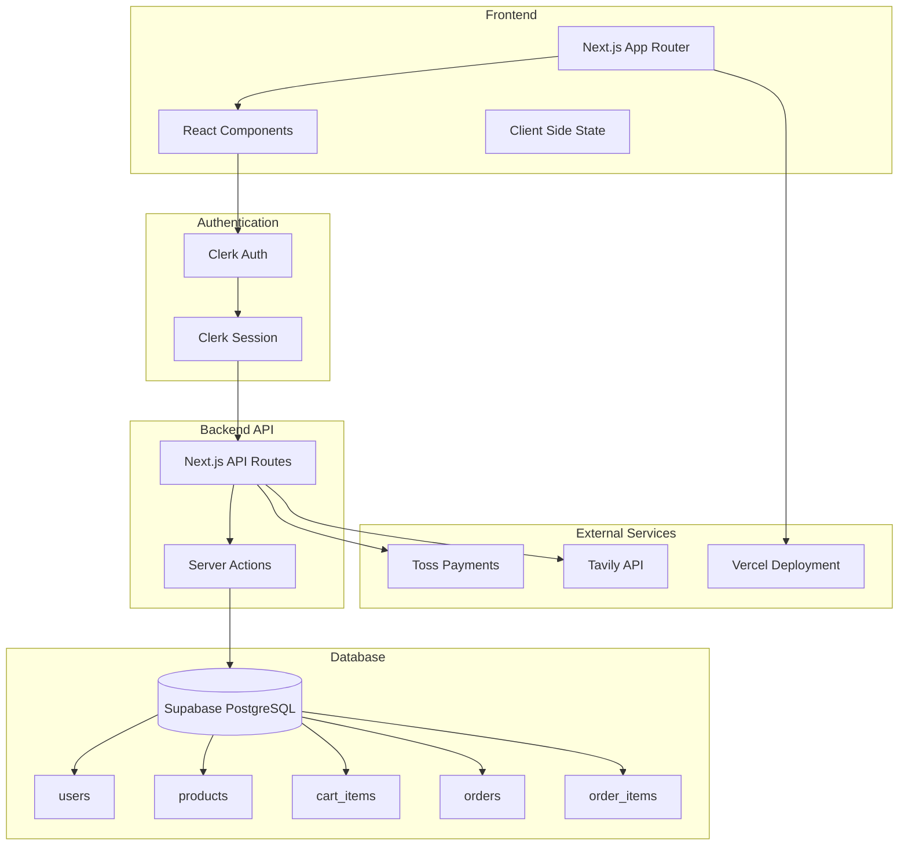
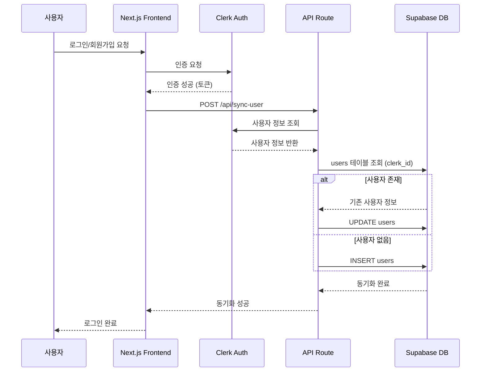
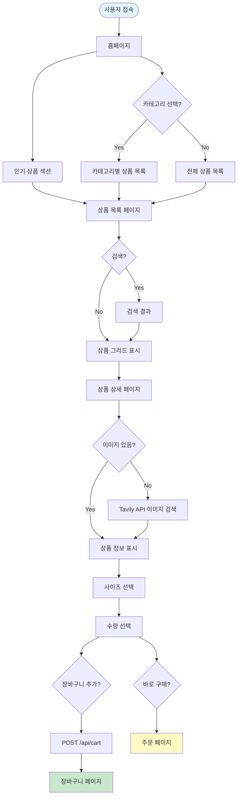
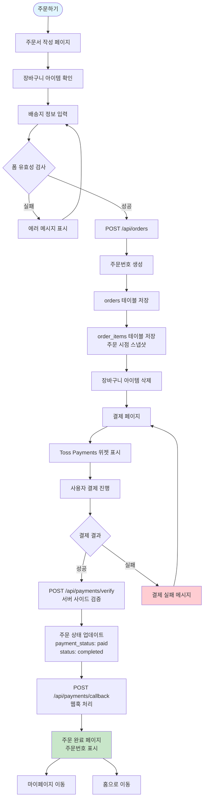
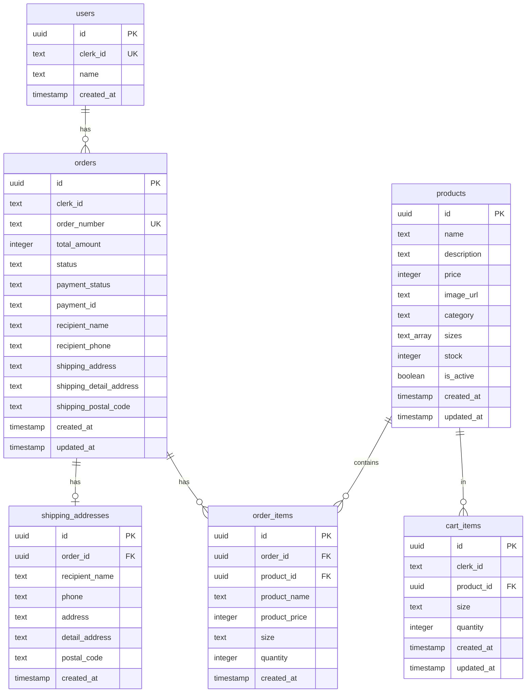
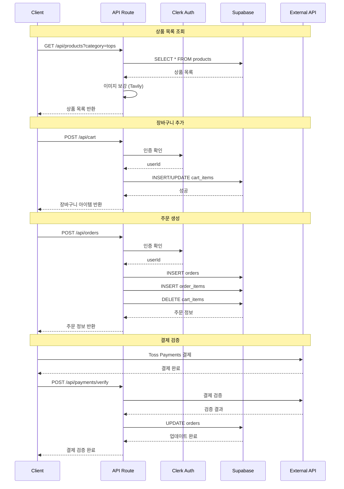
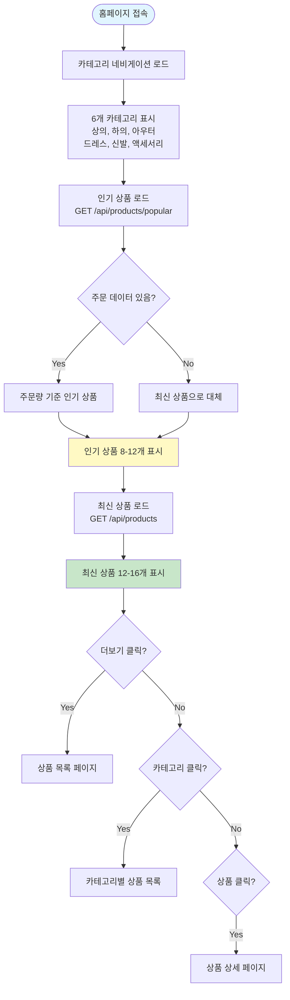
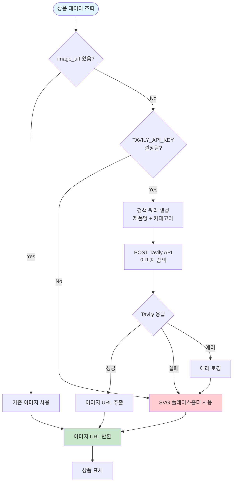

# 쇼핑몰 MVP 플로우 차트

PRD.md를 기반으로 생성한 Mermaid 플로우 차트입니다.

## 1. 전체 시스템 아키텍처



## 2. 사용자 인증 및 동기화 플로우



## 3. 상품 탐색 및 조회 플로우



## 4. 장바구니 관리 플로우

```mermaid
flowchart TD
    Start([장바구니 페이지])
    Start --> LoadCart[GET /api/cart]
    LoadCart --> AuthCheck{Clerk 인증?}

    AuthCheck -->|No| LoginRequired[로그인 요청]
    AuthCheck -->|Yes| FetchCart[장바구니 아이템 조회]

    FetchCart --> DisplayItems[장바구니 아이템 표시]
    DisplayItems --> UpdateQuantity{수량 변경?}
    UpdateQuantity -->|Yes| UpdateAPI[PUT /api/cart/[id]]
    UpdateQuantity -->|No| DeleteItem{아이템 삭제?}

    DeleteItem -->|Yes| DeleteAPI[DELETE /api/cart/[id]]
    DeleteItem -->|No| SelectAll{전체 선택?}

    SelectAll --> CalculateTotal[총 금액 계산]
    UpdateAPI --> RefreshCart[장바구니 새로고침]
    DeleteAPI --> RefreshCart
    RefreshCart --> DisplayItems

    CalculateTotal --> OrderButton[주문하기 버튼]
    OrderButton --> OrderPage[주문서 작성 페이지]

    style Start fill:#e1f5ff
    style OrderPage fill:#fff9c4
    style LoginRequired fill:#ffcdd2
```

## 5. 주문 및 결제 프로세스 플로우



## 6. 데이터베이스 관계도 (ER Diagram)



## 7. API 호출 플로우



## 8. 홈페이지 플로우



## 9. 이미지 보강 플로우 (Tavily API)



## 10. 전체 사용자 여정 (User Journey)

```mermaid
flowchart LR
    A[홈페이지 접속] --> B{로그인 상태?}
    B -->|No| C[로그인/회원가입]
    B -->|Yes| D[상품 탐색]
    C --> E[사용자 동기화<br/>Clerk → Supabase]
    E --> D

    D --> F[카테고리 선택]
    D --> G[검색]
    D --> H[인기 상품 보기]

    F --> I[상품 목록]
    G --> I
    H --> I

    I --> J[상품 상세]
    J --> K{이미지 있음?}
    K -->|No| L[Tavily 이미지 검색]
    K -->|Yes| M[상품 정보 표시]
    L --> M

    M --> N[사이즈/수량 선택]
    N --> O{액션 선택}
    O -->|장바구니| P[장바구니 추가]
    O -->|바로 구매| Q[주문서 작성]

    P --> R[장바구니 페이지]
    R --> S[수량 변경/삭제]
    S --> T[주문하기]
    T --> Q

    Q --> U[배송지 입력]
    U --> V[주문 생성]
    V --> W[Toss Payments 결제]
    W --> X{결제 결과}
    X -->|성공| Y[주문 완료]
    X -->|실패| W
    Y --> Z[마이페이지<br/>주문 내역 확인]

    style A fill:#e1f5ff
    style Y fill:#c8e6c9
    style Z fill:#fff9c4
```



---

**생성일**: 2025-02-13  
**기준 문서**: `docs/PRD.md`  
**버전**: 1.0 (MVP)
